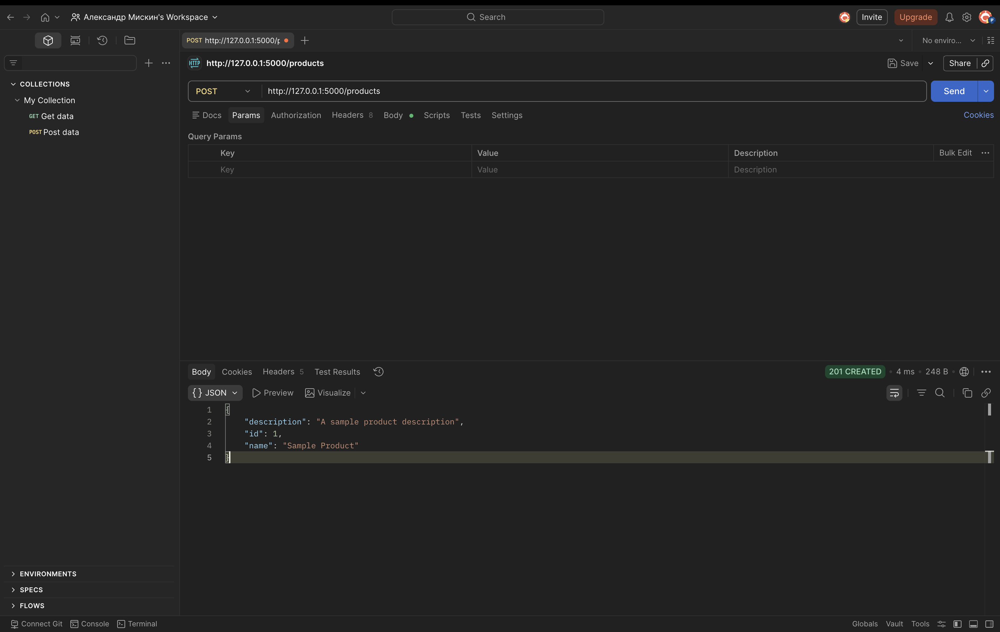
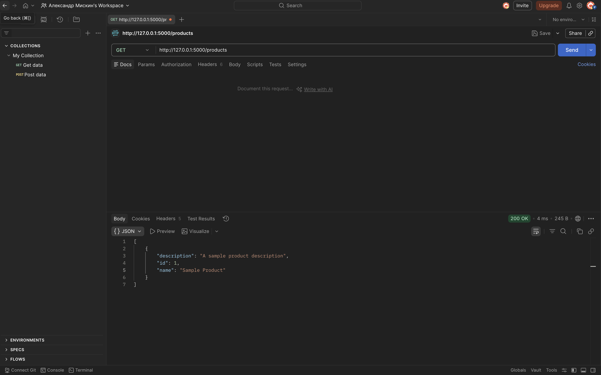
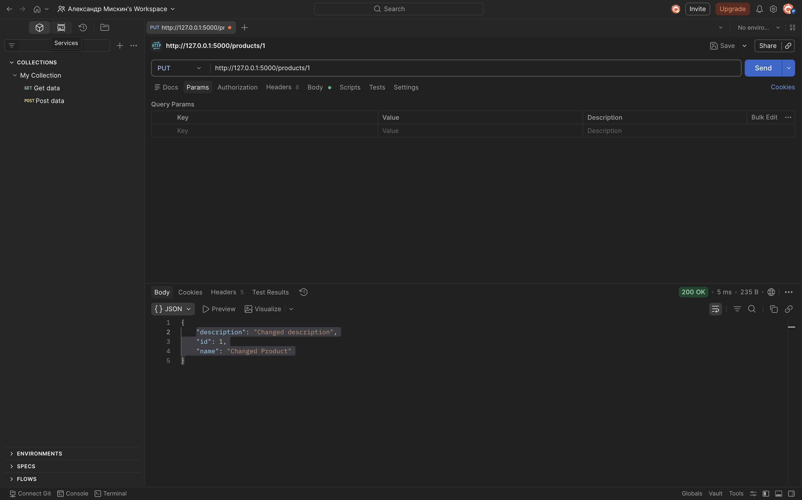
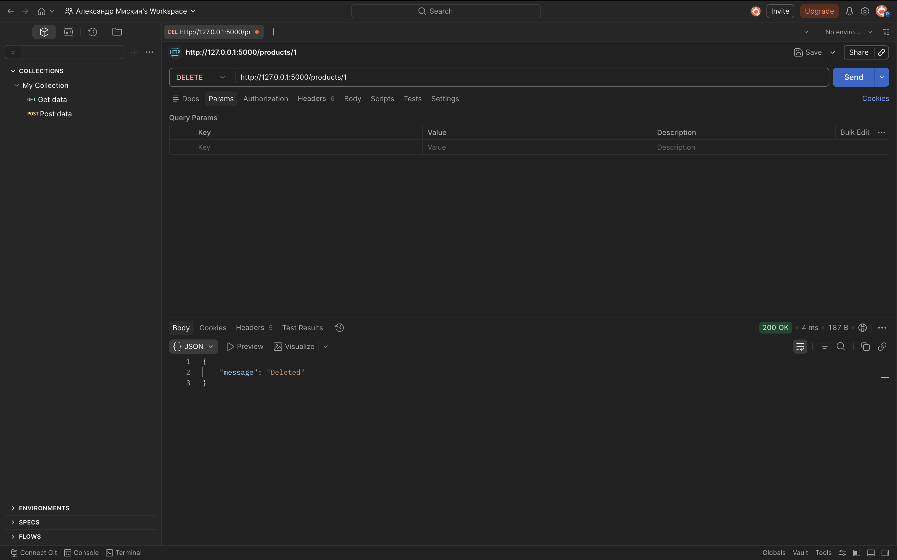
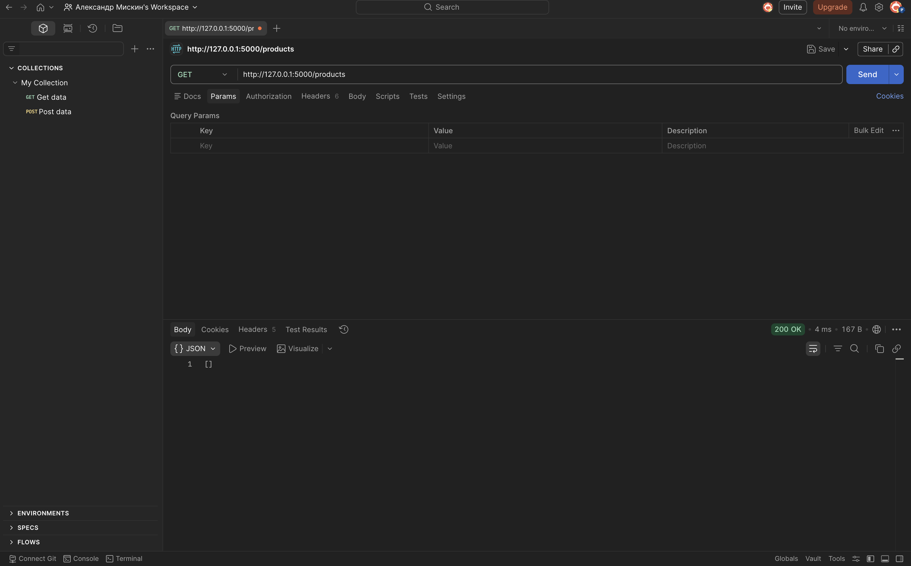
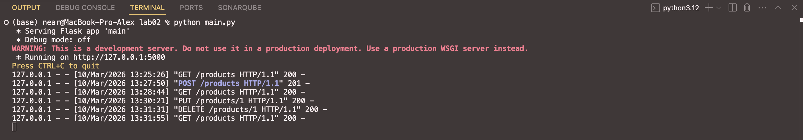

# Практика 2. Rest Service

## Программирование. Rest Service. Часть I

### Задание А (3 балла)
Создайте простой REST сервис, в котором используются HTTP операции GET, POST, PUT и DELETE.
Предположим, что это сервис для будущего интернет-магазина, который пока что умеет 
работать только со списком продуктов. У каждого продукта есть поля: `id` (уникальный идентификатор),
`name` и `description`. 

Таким образом, json-схема продукта (обозначим её `<product-json>`):

```json
{
  "id": 0,
  "name": "string",
  "description": "string"
}
```

Данные продукта от клиента к серверу должны слаться в теле запроса в виде json-а, **не** в параметрах запроса.

Ваш сервис должен поддерживать следующие операции:
1. Добавить новый продукт. При этом его `id` должен сгенерироваться автоматически
   - `POST /product`
   - Схема запроса:
     ```json
     {
       "name": "string",
       "description": "string"
     }
     ```
   - Схема ответа: `<product-json>` (созданный продукт)
2. Получить продукт по его id
   - `GET /product/{product_id}`
   - Схема ответа: `<product-json>`
3. Обновить существующий продукт (обновляются только те поля продукта, которые были переданы в теле запроса)
   - `PUT /product/{product_id}`
   - Схема запроса: `<product-json>` (некоторые поля могут быть опущены)
   - Схема ответа: `<product-json>` (обновлённый продукт)
4. Удалить продукт по его id
   - `DELETE /product/{product_id}`
   - Схема ответа: `<product-json>` (удалённый продукт)
5. Получить список всех продуктов 
   - `GET /products`  
   - Схема ответа:
     ```
     [ 
       <product-json-1>,
       <product-json-2>, 
       ... 
     ]
     ```

Предусмотрите возвращение ошибок (например, если запрашиваемого продукта не существует).

Вы можете положить код сервиса в отдельную директорию рядом с этим документом.

### Задание Б (3 балла)
Продемонстрируйте работоспособность сервиса с помощью программы Postman
(https://www.postman.com/downloads) и приложите соответствующие скрины, на которых указаны
запросы и ответы со стороны сервиса для **всех** его операций.

#### Демонстрация работы
todo

### Задание В (4 балла)
Пусть ваш продукт также имеет иконку (небольшую картинку). Формат иконки (картинки) может
быть любым на ваш выбор. Для простоты будем считать, что у каждого продукта картинка одна.

Добавьте две новые операции:
1. Загрузить иконку:
   - `POST product/{product_id}/image`
   - Запрос содержит бинарный файл — изображение  
     
2. Получить иконку:
   - `GET product/{product_id}/image`
   - В ответе передаётся только сама иконка  
     

Измените операции в Задании А так, чтобы теперь схема продукта содержала сведения о загруженной иконке, например, имя файла или путь:
```json
"icon": "string"
```

#### Демонстрация работы
## Add


## Get


## Update


## Delete


## Get After Delete


## Log


---

_(*) В последующих домашних заданиях вам будет предложено расширить функционал данного сервиса._

## Задачи

### Задача 1 (2 балла)
Общая (сквозная) задержка прохождения для одного пакета от источника к приемнику по пути,
состоящему из $N$ соединений, имеющих каждый скорость $R$ (то есть между источником и
приемником $N - 1$ маршрутизатор), равна $d_{\text{сквозная}} = N \dfrac{L}{R}$
Обобщите данную формулу для случая пересылки количества пакетов, равного $P$.

#### Решение
Ответ: $(N + P - 1) L / R$ \
  Ясно, что в случае $P = 1$ пакет просто тратит на переход по каждому каналу $L / R$ времени. \ В случае $P$ пакетов можно отправлять так:

  Iteration $0: [1...P] [] [] [] ...$ \
  Iteration $1: [2...P] [1] [] [] ...$ \
  Iteration $2: [3...P] [2] [1] [] ...$ \
  $...$

  То есть как только пакет $X$ доходит(полностью) до маршрутизатора $S$, то сразу начинает отправляться по следующему каналу.

  Очевидно что в такой конструкции выше ответ $(N + P - 1) L / R$ \
  (Достаточно лишь следить за последним пакетом, он $P - 1$ *итераций* стоит на месте а потом $N$ *итераций* отправляется($1$ *итерация* - отправка по каналу))


### Задача 2 (2 балла)
Допустим, мы хотим коммутацией пакетов отправить файл с хоста A на хост Б. Между хостами установлены три
последовательных канала соединения со следующими скоростями передачи данных:
$R_1 = 200$ Кбит/с, $R_2 = 3$ Мбит/с и $R_3 = 2$ Мбит/с.
Сколько времени приблизительно займет передача на хост Б файла размером $5$ мегабайт?
Как это время зависит от размера пакета?

#### Решение
  Ответ $\frac{(5 \cdot 1024 \cdot 1024 \cdot 8)}{(200 \cdot 1000)} \approx 209 $ секунд. Потому что второй и третий каналы имеют скорость кратно большую первого, можно считать *итоговую* скоростями передачи как скоростями передачи самого медленного

### Задача 3 (2 балла)
Предположим, что пользователи делят канал с пропускной способностью $2$ Мбит/с. Каждому
пользователю для передачи данных необходима скорость $100$ Кбит/с, но передает он данные
только в течение $20$ процентов времени использования канала. Предположим, что в сети всего $60$
пользователей. А также предполагается, что используется сеть с коммутацией пакетов. Найдите
вероятность одновременной передачи данных $12$ или более пользователями.

#### Решение
  Ответ $P(\text{Binomial}(60, 0.2) \geq 12) \approx 0.56$ (Почему такой очевидно)

  Проблема в том что очевидно канал выдерживает не более $20$ пользователей. Не очень понятно из условия как считать ответ если пришло все таки столько.

  Поэтому ответ $P(\text{Binomial}(60, 0.2) \geq 12)$ 
  или $P(\text{Binomial}(60, 0.2) \geq 12) - P(\text{Binomial}(60, 0.2) \geq 21)$ 

  В зависимости от того что именно требовалось (хотим ли рассматривать случай перегрузки сети когда пришло $\ge 20$ пользователей). В любом случае $P(\text{Binomial}(60, 0.2) \geq 21) \approx 0.003$ так что ответ не сильно поменяется.
  Ответ: $\approx 0.56$

### Задача 4 (2 балла)
Пусть файл размером $X$ бит отправляется с хоста А на хост Б, между которыми три линии связи и
два коммутатора. Хост А разбивает файл на сегменты по $S$ бит каждый и добавляет к ним
заголовки размером $80$ бит, формируя тем самым пакеты длиной $L = 80 + S$ бит. Скорость
передачи данных по каждой линии составляет $R$ бит/с. Загрузка линий мала, и очередей пакетов
нет. При каком значении $S$ задержка передачи файла между хостами А и Б будет минимальной?
Задержкой распространения сигнала пренебречь.

#### Решение
  Колво пакетов $N / S$ (округление ни на что не влияет). Один пакет передается в канал за $(S + 80) / R$

  Итого время $F(S) = (N / S + 2) \cdot (S + 80) / R$, потому что есть два коммутатора($+ 2$ из соображения первой задачи).

  Ну и все осталось $\text{argmin}_{S} F(S)$. Убрав все независищее от $S$ получаем что равносильно минимизировать $80N / S + 2S$, минимум такой штуки из общих соображений достигается при $S = \sqrt{40N}$ 
   (В общем случае $a / S + b S$ достигает минимума при $S = \sqrt{a / b}$)

### Задание 5 (2 балла)
Рассмотрим задержку ожидания в буфере маршрутизатора. Обозначим через $I$ интенсивность
трафика, то есть $I = \dfrac{L a}{R}$.
Предположим, что для $I < 1$ задержка ожидания вычисляется как $\dfrac{I \cdot L}{R (1 – I)}$. 
1. Напишите формулу для общей задержки, то есть суммы задержек ожидания и передачи.
2. Опишите зависимость величины общей задержки от значения $\dfrac{L}{R}$.

#### Решение
todo
