# Практика 4. Прикладной уровень

## Программирование сокетов: Прокси-сервер
Разработайте прокси-сервер для проксирования веб-страниц. 
Приложите скрины, демонстрирующие работу прокси-сервера. 

### Запуск прокси-сервера
Запустите свой прокси-сервер из командной строки, а затем запросите веб-страницу с помощью
вашего браузера. Направьте запросы на прокси-сервер, используя свой IP-адрес и номер порта.
Например, http://localhost:8888/www.google.com

_(*) Вы должны заменить стоящий здесь 8888 на номер порта в серверном коде, 
то есть тот, на котором прокси-сервер слушает запросы._

Вы можете также настроить непосредственно веб-браузер на использование вашего прокси сервера. 
В настройках браузера вам нужно будет указать адрес прокси-сервера и номер порта,
который вы использовали при запуске прокси-сервера (опционально).

### А. Прокси-сервер без кеширования (4 балла)
1. Разработайте свой прокси-сервер для проксирования http GET запросов от клиента веб-серверу 
   с журналированием проксируемых HTTP-запросов. В файле журнала сохраняется
   краткая информация о проксируемых запросах (URL и код ответа). Кеширование в этом
   задании не требуется. **(2 балла)**
2. Добавьте в ваш прокси-сервер обработку ошибок. Отсутствие обработчика ошибок может
   вызвать проблемы. Особенно, когда клиент запрашивает объект, который не доступен, так
   как ответ 404 Not Found, как правило, не имеет тела, а прокси-сервер предполагает, что
   тело есть и пытается прочитать его. **(1 балл)**
3. Простой прокси-сервер поддерживает только метод GET протокола HTTP. Добавьте
   поддержку метода POST. В запросах теперь будет использоваться также тело запроса
   (body). Для вызова POST запросов вы можете использовать Postman. **(1 балл)**

Приложите скрины или логи работы сервера.

#### Демонстрация работы

   Тут нет последнего пункта, есть какая то обработка ошибок(+-)

   ```
   python3 proxy.py
   ```

   И в браузере
   ```
   http://localhost:8889/example.com
   ```

   ```
   (base) near@MacBook-Pro-Alex lab04 % python3 proxy.py
   Proxy is running on http://127.0.0.1:8889
   Client connected: ('127.0.0.1', 61307)
   GET http://example.com -> 200
   Client connected: ('127.0.0.1', 61312)
   Client connected: ('127.0.0.1', 61314)
   Client connected: ('127.0.0.1', 61316)
   ```

   И в loge: 
   ```
   http://example.com 200
   error 502
   error 502
   error 502
   http://example.com 200
   ```

### Б. Прокси-сервер с кешированием (4 балла)
Когда прокси-сервер получает запрос, он проверяет, есть ли запрашиваемый объект в кэше, и,
если да, то возвращает объект из кэша без соединения с веб-сервером. Если объекта в кэше нет,
прокси-сервер извлекает его с веб-сервера обычным GET запросом, возвращает клиенту и
кэширует копию для будущих запросов.

Для проверки того, прокис объект в кеше или нет, необходимо использовать условный GET
запрос. В таком случае вам необходимо указывать в заголовке запроса значение для If-Modified-Since и If-None-Match. 
Подробности можно найти [тут](https://ruturajv.wordpress.com/2005/12/27/conditional-get-request).

Будем считать, что кеш-память прокси-сервера хранится на его жестком диске. Ваш прокси-сервер
должен уметь записывать ответы в кеш и извлекать данные из кеша (т.е. с диска) в случае
попадания в кэш при запросе. Для этого необходимо реализовать некоторую внутреннюю
структуру данных, чтобы отслеживать, какие объекты закешированы.

Приложите скрины или логи, из которых понятно, что ответ на повторный запрос был взят из кэша.

#### Демонстрация работы
todo

### В. Черный список (2 балла)
Прокси-сервер отслеживает страницы и не пускает на те, которые попадают в черный список. Вместо
этого прокси-сервер отправляет предупреждение, что страница заблокирована. Список доменов
и/или URL-адресов для блокировки по черному списку задается в **конфигурационном файле**.

Приложите скрины или логи запроса из черного списка.

#### Демонстрация работы
todo

## Wireshark. Работа с DNS
Для каждого задания в этой секции приложите скрин с подтверждением ваших ответов.

### А. Утилита nslookup (1 балл)

#### Вопросы
1. Выполните nslookup, чтобы получить IP-адрес какого-либо веб-сервера в Азии
   ```
   (base) near@MacBook-Pro-Alex lab04 % nslookup www.u-tokyo.ac.jp 8.8.8.8
   Server:         8.8.8.8
   Address:        8.8.8.8#53

   Non-authoritative answer:
   Name:   www.u-tokyo.ac.jp
   Address: 210.152.243.234
   ```
2. Выполните nslookup, чтобы определить авторитетные DNS-серверы для какого-либо университета в Европе
   ```
   (base) near@MacBook-Pro-Alex lab04 % nslookup -type=NS ox.ac.uk 8.8.8.8
   Server:         8.8.8.8
   Address:        8.8.8.8#53

   Non-authoritative answer:
   ox.ac.uk        nameserver = dns1.ox.ac.uk.
   ox.ac.uk        nameserver = dns0.ox.ac.uk.
   ox.ac.uk        nameserver = auth4.dns.ox.ac.uk.
   ox.ac.uk        nameserver = auth6.dns.ox.ac.uk.
   ox.ac.uk        nameserver = auth5.dns.ox.ac.uk.
   ox.ac.uk        nameserver = dns2.ox.ac.uk.
   ```
   Это для Oxford University.
3. Используя nslookup, найдите веб-сервер, имеющий несколько IP-адресов. Сколько IP-адресов имеет веб-сервер вашего учебного заведения?
   ```
   (base) near@MacBook-Pro-Alex lab04 % nslookup www.google.com 8.8.8.8
   Server:         8.8.8.8
   Address:        8.8.8.8#53

   Non-authoritative answer:
   Name:   www.google.com
   Address: 142.251.155.119
   Name:   www.google.com
   Address: 142.251.151.119
   Name:   www.google.com
   Address: 142.251.154.119
   Name:   www.google.com
   Address: 142.251.156.119
   Name:   www.google.com
   Address: 142.251.157.119
   Name:   www.google.com
   Address: 142.251.152.119
   Name:   www.google.com
   Address: 142.251.153.119
   Name:   www.google.com
   Address: 142.251.150.119
   ```
   Тут вроде 8 штук. 
   ```
   (base) near@MacBook-Pro-Alex lab04 % nslookup www.spbu.ru 8.8.8.8
   Server:         8.8.8.8
   Address:        8.8.8.8#53

   Non-authoritative answer:
   www.spbu.ru     canonical name = spbu.ru.
   Name:   spbu.ru
   Address: 195.70.219.100
   ```

   Наш имеет почетный $1$ ip адрес.

### Б. DNS-трассировка www.ietf.org (3 балла)

#### Подготовка
1. Используйте ipconfig для очистки кэша DNS на вашем компьютере.
2. Откройте браузер и очистите его кэш (для Chrome можете использовать сочетание клавиш
   CTRL+Shift+Del).
3. Запустите Wireshark и введите `ip.addr == ваш_IP_адрес` в строке фильтра, где значение
   ваш_IP_адрес вы можете получить, используя утилиту ipconfig. Данный фильтр позволит
   нам отбросить все пакеты, не относящиеся к вашему хосту. Запустите процесс захвата пакетов в Wireshark.
4. Зайдите на страницу www.ietf.org в браузере.
5. Остановите захват пакетов.

#### Вопросы
1. Найдите DNS-запрос и ответ на него. С использованием какого транспортного протокола
   они отправлены?
   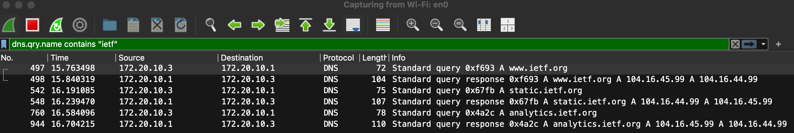

   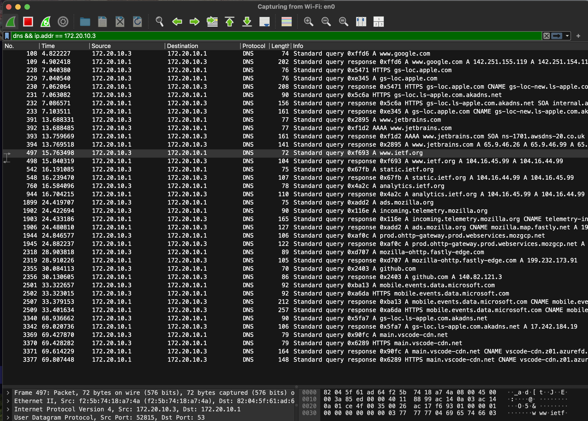 (но тут лишнего много)


   Запрос: 172.20.10.3 -> 172.20.10.1, A www.ietf.org

   Ответ: 172.20.10.1 -> 172.20.10.3, A 104.16.45.99, A 104.16.44.99

   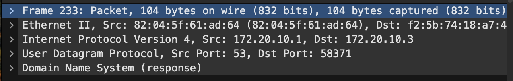 

   Ответ: UDP
2. Какой порт назначения у запроса DNS?

   53 (тоже видно на картинке выше)

3. На какой IP-адрес отправлен DNS-запрос? Используйте ipconfig для определения IP-адреса
   вашего локального DNS-сервера. Одинаковы ли эти два адреса?
   
   172.20.10.1

   Локальный DNS-сервер тоже:

   172.20.10.1

   Адреса совпадают.


4. Проанализируйте сообщение-запрос DNS. Запись какого типа запрашивается? Содержатся
   ли в запросе какие-нибудь «ответы»?
   
   Запрашивается DNS-запись типа A для www.ietf.org  (тип A это IPv4-адрес домена)

   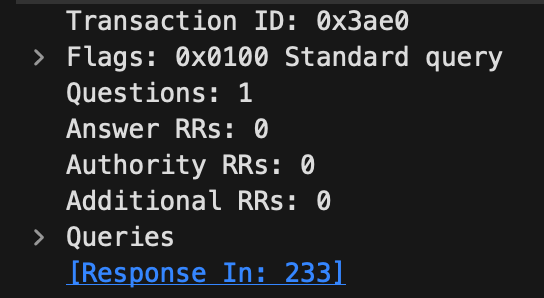 
   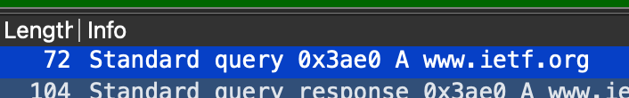 

   Ответов 0. 

5. Проанализируйте ответное сообщение DNS. Сколько в нем «ответов»? Что содержится в
   каждом?
   Два ответа:

   www.ietf.org A 104.16.45.99

   www.ietf.org A 104.16.44.99


   Ну а сами ответы можно посмотреть(+ еще на фотке щас покажу)

   1. www.ietf.org: type A, class IN, addr 104.16.45.99

   2. www.ietf.org: type A, class IN, addr 104.16.44.99

   Снизу слева

   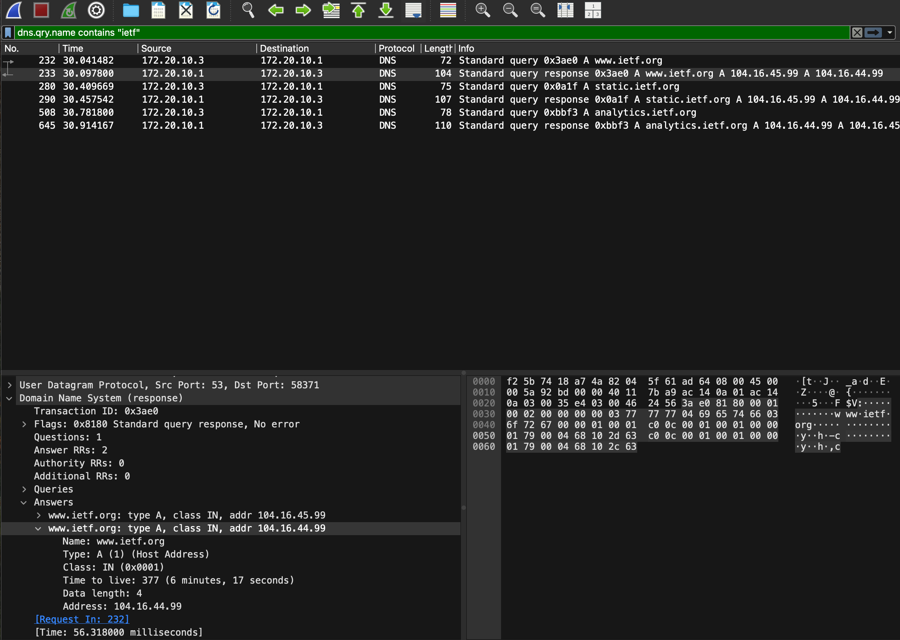

6. Посмотрите на последующий TCP-пакет с флагом SYN, отправленный вашим компьютером.
   Соответствует ли IP-адрес назначения пакета с SYN одному из адресов, приведенных в
   ответном сообщении DNS?
   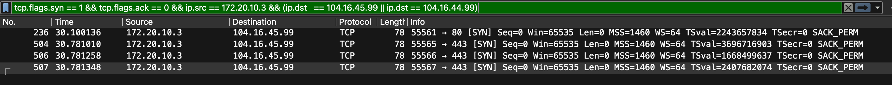

   Да совпадает(а именно ip адрес 104.16.45.99) (Надо смотреть на первый запрос)

7. Веб-страница содержит изображения. Выполняет ли хост новые запросы DNS перед
   загрузкой этих изображений?

   Да, выполняет:
   на одной из картинок выше видно, что после запроса к www.ietf.org были новые DNS-запросы:

   static.ietf.org

   analytics.ietf.org


### В. DNS-трассировка www.spbu.ru (2 балла)

#### Подготовка
1. Запустите захват пакетов с тем же фильтром `ip.addr == ваш_IP_адрес`
2. Выполните команду nslookup для сервера www.spbu.ru
3. Остановите захват
4. Вы увидите несколько пар запрос-ответ DNS. Найдите последнюю пару, все вопросы будут относиться к ней
   


#### Вопросы
1. Каков порт назначения в запросе DNS? Какой порт источника в DNS-ответе?
   - 53
   - 53  (Там только 1 фото, зачем два раза фоткать, но поверьте))))
2. На какой IP-адрес отправлен DNS-запрос? Совпадает ли он с адресом локального DNS-сервера, установленного по умолчанию?
   - DNS-запрос отправлен на IP-адрес 172.20.10.1. Совпадает с адресом локального DNS-сервера по умолчанию.
3. Проанализируйте сообщение-запрос DNS. Запись какого типа запрашивается? Содержатся
   ли в запросе какие-нибудь «ответы»?
   - Запрашивается DNS-запись типа A для имени www.spbu.ru.
   - Тип A означает IPv4-адрес домена.
   - Ответов в DNS-запросе нет(Answer RRs = 0)
4. Проанализируйте ответное сообщение DNS. Сколько в нем «ответов»? Что содержится в каждом?
   1. www.spbu.ru CNAME spbu.ru
   2. spbu.ru A 195.70.219.100

   - В одном содержится ip адрес сервера. А во втором его алиас (spbu.ru)

   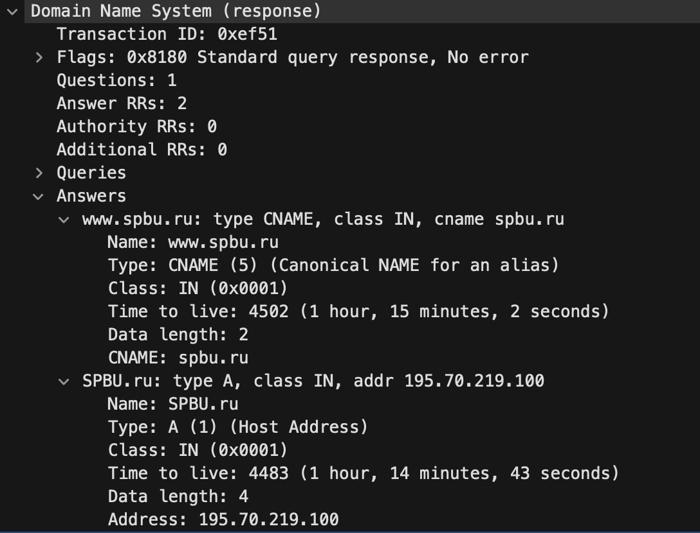


### Г. DNS-трассировка nslookup –type=NS (1 балл)
Повторите все шаги по предварительной подготовке из Задания B, но теперь для команды `nslookup –type=NS spbu.ru`
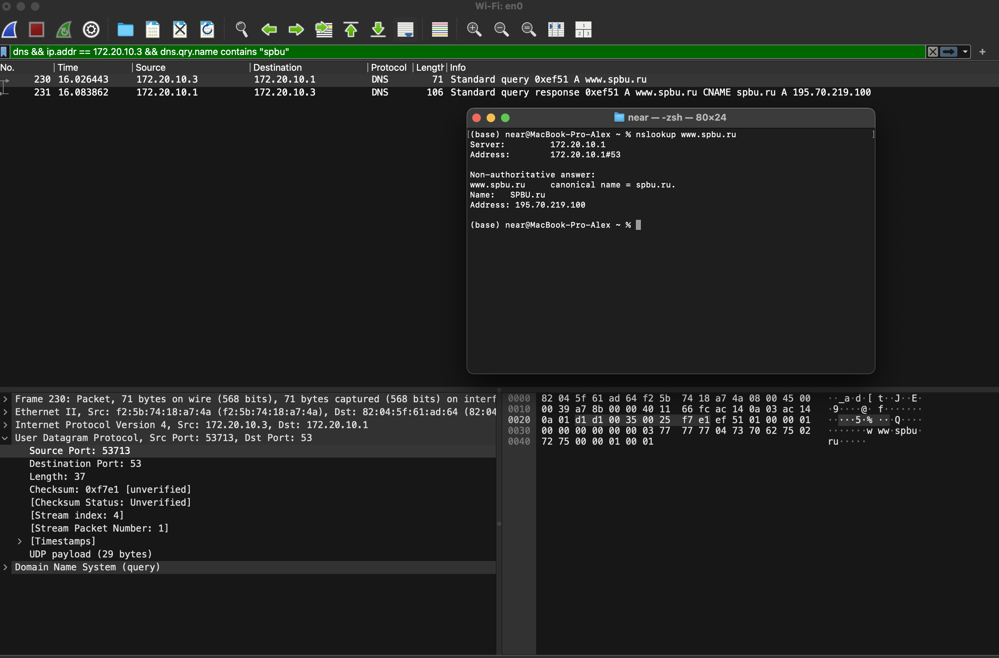
#### Вопросы
1. На какой IP-адрес отправлен DNS-запрос? Совпадает ли он с адресом локального DNS-сервера, установленного по умолчанию?
   - DNS-запрос отправлен на IP-адрес 172.20.10.1. Да, он совпадает с адресом локального DNS-сервера по умолчанию.
2. Проанализируйте сообщение-запрос DNS. Запись какого типа запрашивается? Содержатся ли в запросе какие-нибудь «ответы»?
   - Запрашивается DNS-запись типа NS для домена spbu.ru.
   - Ответов в самом DNS-запросе нет(Answer RRs = 0)
3. Проанализируйте ответное сообщение DNS. Имена каких DNS-серверов университета в
   нем содержатся? А есть ли их адреса в этом ответе?
   - ns.pu.ru
   - ns2.pu.ru
   - ns7.spbu.ru

   - А вот адресов нету 
   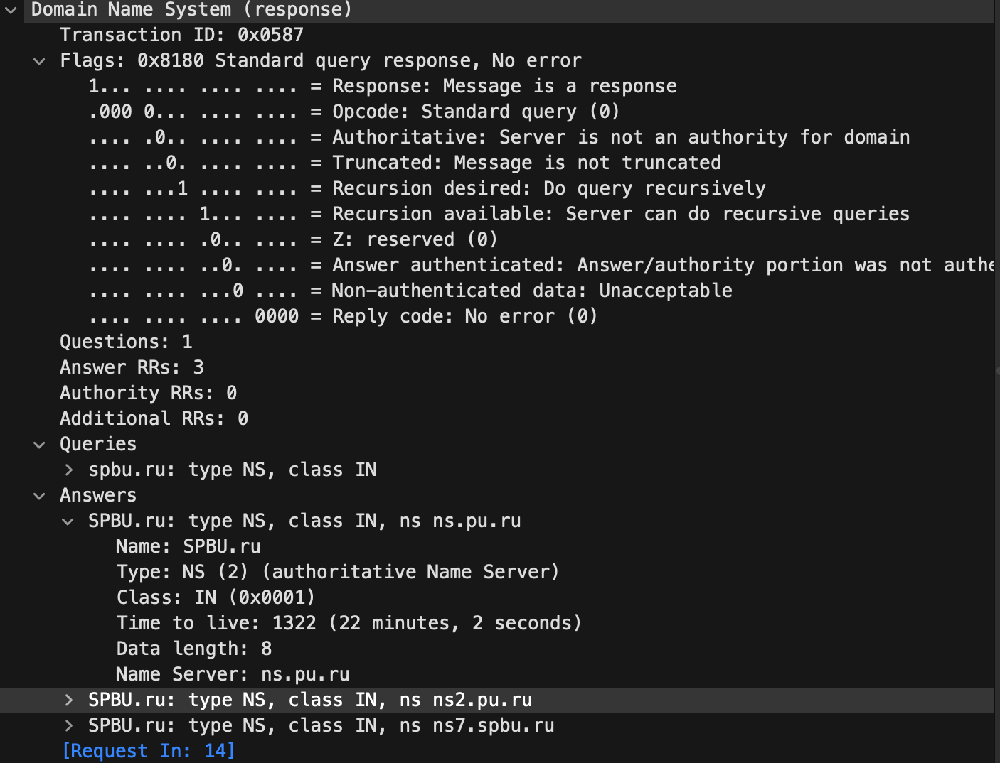

### Д. DNS-трассировка nslookup www.spbu.ru ns2.pu.ru (1 балл)
Снова повторите все шаги по предварительной подготовке из Задания B, но теперь для команды `nslookup www.spbu.ru ns2.pu.ru`.
Запись `nslookup host_name dns_server` означает, что запрос на разрешение доменного имени `host_name` пойдёт к `dns_server`.
Если параметр `dns_server` не задан, то запрос идёт к DNS-серверу по умолчанию (например, к локальному).

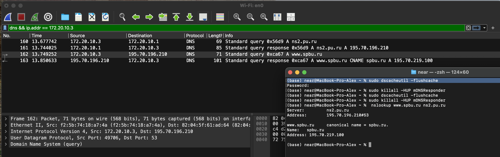

#### Вопросы
1. На какой IP-адрес отправлен DNS-запрос? Совпадает ли он с адресом локального DNS-сервера, установленного по умолчанию? 
   Если нет, то какому хосту он принадлежит?
   - ns2.pu.ru A 195.70.196.210

   - После этого основной DNS-запрос для www.spbu.ru был отправлен на 195.70.196.210.

   - Этот адрес не совпадает с локальным DNS-сервером 172.20.10.1.
   - Он принадлежит хосту ns2.pu.ru.
2. Проанализируйте сообщение-запрос DNS. Запись какого типа запрашивается? Содержатся
   ли в запросе какие-нибудь «ответы»?
   - A для имени: www.spbu.ru
   - Ответов в самом запросе нет(Answer RRs = 0)
3. Проанализируйте ответное сообщение DNS. Сколько в нем «ответов»? Что содержится в
   каждом?
   - www.spbu.ru CNAME spbu.ru
   - spbu.ru A 195.70.219.100

   - Первый ответ показывает, что www.spbu.ru является псевдонимом для spbu.ru.
   - Второй ответ содержит IPv4-адрес домена spbu.ru: 195.70.219.100
### Е. Сервисы whois (2 балла)
1. Что такое база данных whois?
   - Публичная база данных, содержащая иформацию свободен ли домен, дату регистрации и контактные данные владельцев доменных имен.
2. Используя различные сервисы whois в Интернете, получите имена любых двух DNS-серверов. 
   Какие сервисы вы при этом использовали?

   Сервисы:
   - https://www.whois.com/whois/
   - https://lookup.icann.org

   DNS сервера(пусть будут 4): 
   - ns1.google.com
   - ns2.google.com
   - ns3.google.com
   - ns4.google.com
3. Используйте команду nslookup на локальном хосте, чтобы послать запросы трем конкретным
   серверам DNS (по аналогии с Заданием Д): вашему локальному серверу DNS и двум DNS-серверам,
   найденным в предыдущей части.

   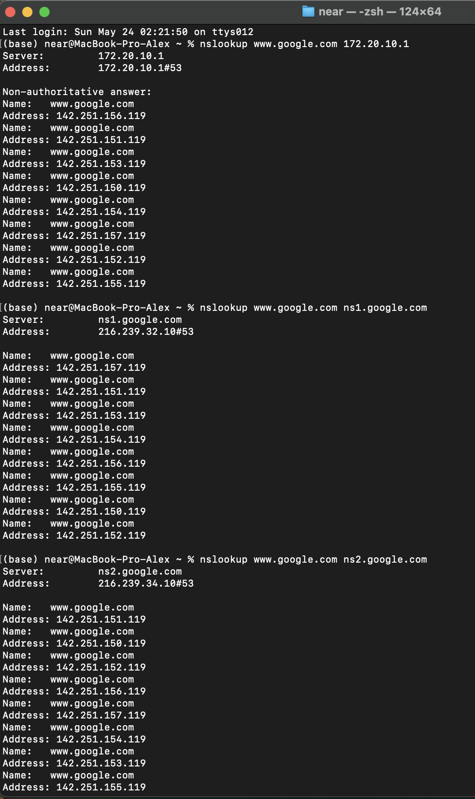
