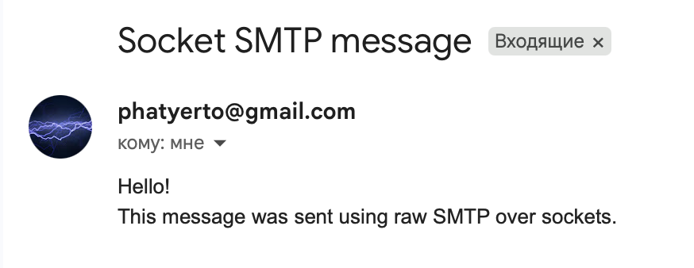
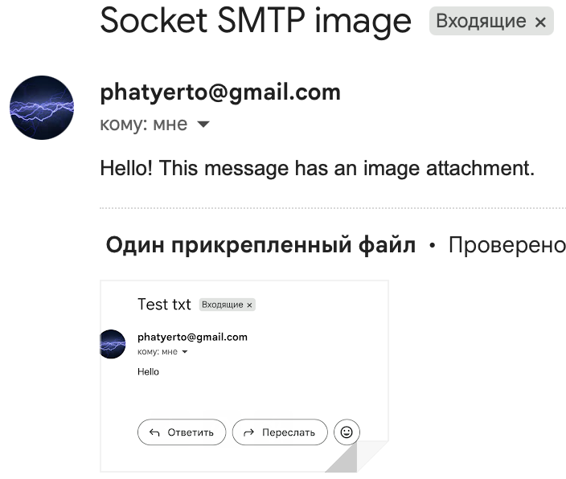

# Практика 5. Прикладной уровень

## Программирование сокетов.

### A. Почта и SMTP (7 баллов)

### 1. Почтовый клиент (2 балла)
Напишите программу для отправки электронной почты получателю, адрес
которого задается параметром. Адрес отправителя может быть постоянным. Программа
должна поддерживать два формата сообщений: **txt** и **html**. Используйте готовые
библиотеки для работы с почтой, т.е. в этом задании **не** предполагается общение с smtp
сервером через сокеты напрямую.

Приложите скриншоты полученных сообщений (для обоих форматов).

#### Демонстрация работы
```
python3 smtp_socket_client.py phatyerto@gmail.com APP_PASSWORD
```

### 2. SMTP-клиент (3 балла)
Разработайте простой почтовый клиент, который отправляет текстовые сообщения
электронной почты произвольному получателю. Программа должна соединиться с
почтовым сервером, используя протокол SMTP, и передать ему сообщение.
Не используйте встроенные методы для отправки почты, которые есть в большинстве
современных платформ. Вместо этого реализуйте свое решение на сокетах с передачей
сообщений почтовому серверу.

Сделайте скриншоты полученных сообщений.

#### Демонстрация работы
```
python3 smtp_socket_image.py phatyerto@gmail.com images/image.png APP_PASSWORD
```

### 3. SMTP-клиент: бинарные данные (2 балла)
Модифицируйте ваш SMTP-клиент из предыдущего задания так, чтобы теперь он мог
отправлять письма с изображениями (бинарными данными).

Сделайте скриншот, подтверждающий получение почтового сообщения с картинкой.

#### Демонстрация работы






---

_Многие почтовые серверы используют ssl, что может вызвать трудности при работе с ними из
ваших приложений. Можете использовать для тестов smtp сервер СПбГУ: mail.spbu.ru, 25_

### Б. Удаленный запуск команд (3 балла)
Напишите программу для запуска команд (или приложений) на удаленном хосте с помощью TCP сокетов.

Например, вы можете с клиента дать команду серверу запустить приложение Калькулятор или
Paint (на стороне сервера). Или запустить консольное приложение/утилиту с указанными
параметрами. Однако запущенное приложение **должно** выводить какую-либо информацию на
консоль или передавать свой статус после запуска, который должен быть отправлен обратно
клиенту. Продемонстрируйте работу вашей программы, приложив скриншот.

Например, удаленно запускается команда `ping yandex.ru`. Результат этой команды (запущенной на
сервере) отправляется обратно клиенту.

#### Демонстрация работы
todo

### В. Широковещательная рассылка через UDP (2 балла)
Реализуйте сервер (веб-службу) и клиента с использованием интерфейса Socket API, которая:
- работает по протоколу UDP
- каждую секунду рассылает широковещательно всем клиентам свое текущее время
- клиент службы выводит на консоль сообщаемое ему время

#### Демонстрация работы
todo

## Задачи

### Задача 1 (2 балла)
Рассмотрим короткую, $10$-метровую линию связи, по которой отправитель может передавать
данные со скоростью $150$ бит/с в обоих направлениях. Предположим, что пакеты, содержащие
данные, имеют размер $100000$ бит, а пакеты, содержащие только управляющую информацию
(например, флаг подтверждения или информацию рукопожатия) – $200$ бит. Предположим, что у
нас $10$ параллельных соединений, и каждому предоставлено $1/10$ полосы пропускания канала
связи. Также допустим, что используется протокол HTTP, и предположим, что каждый
загруженный объект имеет размер $100$ Кбит, и что исходный объект содержит $10$ ссылок на другие
объекты того же отправителя. Будем считать, что скорость распространения сигнала равна
скорости света ($300 \cdot 10^6$ м/с).
1. Вычислите общее время, необходимое для получения всех объектов при параллельных
непостоянных HTTP-соединениях
2. Вычислите общее время для постоянных HTTP-соединений. Ожидается ли существенное
преимущество по сравнению со случаем непостоянного соединения?

#### Решение
 
Задержка распространения = 10 / (300 * 10^6) ≈ 0, можно опустить. 

Время передачи одного объекта по полной линии 100000 / 150 = 666.67 с. 

RTT = 2 * 200 / 150 = 2.67c


Для начального:

2RTT + 100000 / 150 = 2 * 2.67 + 666.67 = 672 с.

Для 10 параллельных непостоянных соединений: 150 / 10 = 15 бит/с. 

Время для передачи одного объекта 100000 / 15 = 6666.67 с

RTT = 2 * 200 / 15 = 26.67 с

Так как паралельно: 2RTT + 6666.67 = 2 * 26.67 + 6666.67 = 6720 с

Итого 672 + 6720 = 7392c


Для постоянного все 11 объектов идут по 1 линии, нужно столько времени 11 * 100000 / 150 = 7333.33 с

Добавим установку соединения и запросы 

12RTT + 7333.33 = 12 * 2.67 + 7333.33 = 7365.37 с

Получилось в целом чуть чуть получше чем в непостоянных, но так можно сказать что почти равны.


### Задача 2 (3 балла)
Рассмотрим раздачу файла размером $F = 15$ Гбит $N$ пирам. Сервер имеет скорость отдачи $u_s = 30$
Мбит/с, а каждый узел имеет скорость загрузки $d_i = 2$ Мбит/с и скорость отдачи $u$. Для $N = 10$, $100$
и $1000$ и для $u = 300$ Кбит/с, $700$ Кбит/с и $2$ Мбит/с подготовьте график минимального времени
раздачи для всех сочетаний $N$ и $u$ для вариантов клиент-серверной и одноранговой раздачи.

#### Решение
Для клиент-серверной раздачи:

- $Answer = max(N * \frac{F}{u_s}, \frac{F}{d})$

Для одноранговой раздачи:

- $Answer = max(\frac{F}{u_s}, \frac{F}{d}, N * \frac{F}{u_s + N * u})$ (потому что еще пиры друг другу могут данные гонять)

Тут $F = 15000$ Мбит, $u_s = 30$ Мбит/с, $d = 2$ Мбит/с.

Клиент-серверная раздача:

| N | u = 0.3 Мбит/с | u = 0.7 Мбит/с | u = 2 Мбит/с |
|---|---:|---:|---:|
| 10 | 7500 | 7500 | 7500 |
| 100 | 50000 | 50000 | 50000 |
| 1000 | 500000 | 500000 | 500000 |

Одноранговая раздача:

| N | u = 0.3 Мбит/с | u = 0.7 Мбит/с | u = 2 Мбит/с |
|---|---:|---:|---:|
| 10 | 7500 | 7500 | 7500 |
| 100 | 25000 | 15000 | 7500 |
| 1000 | 45454.55 | 20547.95 | 7500 |


### Задача 3 (3 балла)
Рассмотрим клиент-серверную раздачу файла размером $F$ бит $N$ пирам, при которой сервер
способен отдавать одновременно данные множеству пиров – каждому с различной скоростью,
но общая скорость отдачи при этом не превышает значения $u_s$. Схема раздачи непрерывная.
1. Предположим, что $\dfrac{u_s}{N} \le d_{min}$.
   При какой схеме общее время раздачи будет составлять $\dfrac{N F}{u_s}$?
2. Предположим, что $\dfrac{u_s}{N} \ge d_{min}$. 
   При какой схеме общее время раздачи будет составлять  $\dfrac{F}{d_{min}}$?
3. Докажите, что минимальное время раздачи описывается формулой $\max\left(\dfrac{N F}{u_s}, \dfrac{F}{d_{min}}\right)$?

#### Решение
todo
