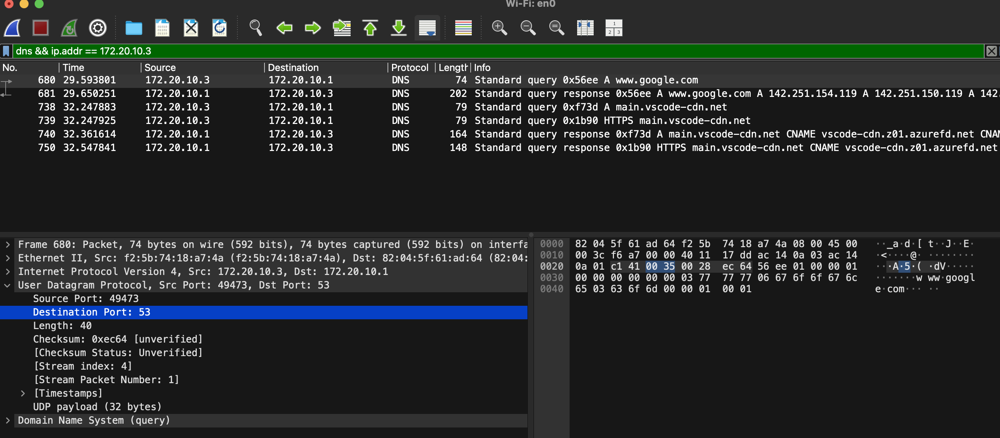
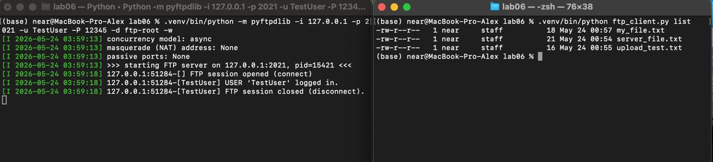
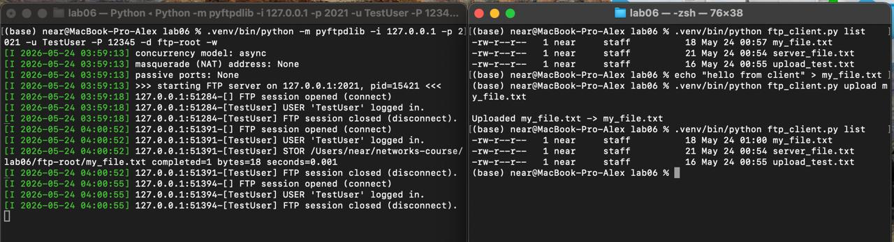
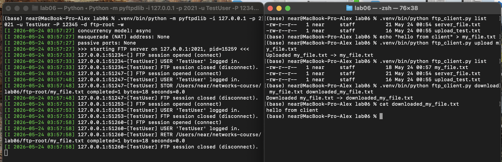
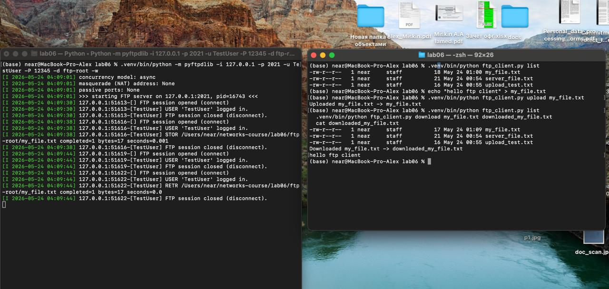

# Практика 6. Транспортный уровень

## Wireshark: UDP (5 баллов)
Начните захват пакетов в приложении Wireshark и затем сделайте так, чтобы ваш хост отправил и
получил несколько UDP-пакетов (например, с помощью обращений DNS).
Выберите один из UDP-пакетов и разверните поля UDP в окне деталей заголовка пакета.
Ответьте на вопросы ниже, представив соответствующие скрины программы Wireshark.

 
#### Вопросы
1. Выберите один UDP-пакет. По этому пакету определите, сколько полей содержит UDP-заголовок.
   - UDP-заголовок содержит 4 поля: Source Port, Destination Port, Length, Checksum.
2. Определите длину (в байтах) для каждого поля UDP-заголовка, обращаясь к отображаемой
   информации о содержимом полей в данном пакете.
   - Все по 2 байта(можно прокликать по полям и посмотреть на сколько выделяется байтов справа где уже данные прям)
3. Значение в поле Length (Длина) – это длина чего?
   - Длина всего UDP-сегмента в байтах т.e UDP-заголовок + данные
4. Какое максимальное количество байт может быть включено в полезную нагрузку UDP-пакета?
   - 65535 - 8 = 65527 байт (ну то есть всё минус заголовок)
5. Чему равно максимально возможное значение номера порта отправителя?
   - 65535 (просто максимальное что влезает в 16 бит)
6. Какой номер протокола для протокола UDP? Дайте ответ и для шестнадцатеричной и
   десятеричной системы. Чтобы ответить на этот вопрос, вам необходимо заглянуть в поле
   Протокол в IP-дейтаграмме, содержащей UDP-сегмент.
   - десятичный: 17
   - шестнадцатеричный: 0x11
   - Видно в IPv4-заголовке: Protocol: UDP (17) (точнее вам не видно, если я нажму на Internet Protocol Version 4 то там будет написано)
7. Проверьте UDP-пакет и ответный UDP-пакет, отправляемый вашим хостом. Определите
   отношение между номерами портов в двух пакетах.
   - Просто меняются местами.

## Программирование. FTP

### FileZilla сервер и клиент (3 балла)
1. Установите сервер и клиент [FileZilla](https://filezilla.ru/get)
2. Создайте FTP сервер. Например, по адресу 127.0.0.1 и портом 21. 
   Укажите директорию по умолчанию для работы с файлами.
3. Создайте пользователя TestUser. Для простоты и удобства можете отключить использование сертификатов.
4. Запустите FileZilla клиента (GUI) и попробуйте поработать с файлами (создать папки,
добавить/удалить файлы).

Приложите скриншоты.

**Важно**: FileZilla не получилось(не справился на Mac) поставить - был использован простой локальный FTP-сервер на Python(pyftpdlib), поднимает локальный FTP-сервер, к которому можно подключаться обычным FTP-клиентом.

Сервер был запущен на 127.0.0.1:2021.

Пользователь: TestUser.

Пароль: 12345.

Какие то команды ниже с которыми запускал

В одной консоли
```
.venv/bin/python -m pyftpdlib -i 127.0.0.1 -p 2021 -u TestUser -P 12345 -d ftp-root -w
```

В другой:
```
.venv/bin/python ftp_client.py list

echo "hello from client" > my_file.txt

.venv/bin/python ftp_client.py upload my_file.txt

.venv/bin/python ftp_client.py list

.venv/bin/python ftp_client.py download my_file.txt downloaded_my_file.txt

cat downloaded_my_file.txt
```

#### Скрины
  

  

  

### FTP клиент (3 балла)
Создайте консольное приложение FTP клиента для работы с файлами по FTP. Приложение может
обращаться к FTP серверу, созданному в предыдущем задании, либо к какому-либо другому серверу 
(есть много публичных ftp-серверов для тестирования, [вот](https://dlptest.com/ftp-test/) один из них).

Приложение должно:
- Получать список всех директорий и файлов сервера и выводить его на консоль
- Загружать новый файл на сервер
- Загружать файл с сервера и сохранять его локально

#### Демонстрация работы

Аналогично прошлому замечение про FileZilla, сорри.

 

Бонус: Не используйте готовые библиотеки для работы с FTP (например, ftplib для Python), а реализуйте решение на сокетах **(+3 балла)**.


### GUI FTP клиент (4 балла)
Реализуйте приложение FTP клиента с графическим интерфейсом. НЕ используйте C#.

Возможный интерфейс:


В приложении должна быть поддержана следующая функциональность:
- Выбор сервера с указанием порта, логин и пароль пользователя и возможность
подключиться к серверу. При подключении на экран выводится список всех доступных
файлов и директорий
- Поддержаны CRUD операции для работы с файлами. Имя файла можно задавать из
интерфейса. При создании нового файла или обновлении старого должно открываться
окно, в котором можно редактировать содержимое файла. При команде Retrieve
содержимое файла можно выводить в главном окне.

#### Демонстрация работы
todo

### FTP сервер (5 баллов)
Реализуйте свой FTP сервер, который работает поверх TCP сокетов. Вы можете использовать FTP клиента, реализованного на прошлом этапе, для тестирования своего сервера.
Сервер должен реализовать возможность авторизации (с указанием логина/пароля) и поддерживать команды:
- CWD
- PWD
- PORT
- NLST
- RETR
- STOR
- QUIT

#### Демонстрация работы
todo
