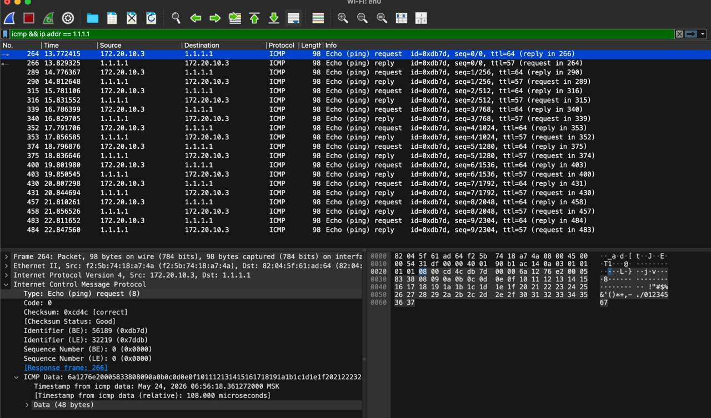
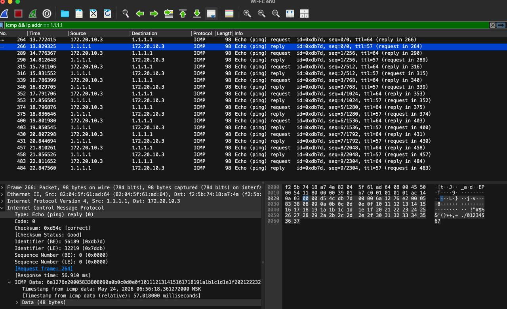
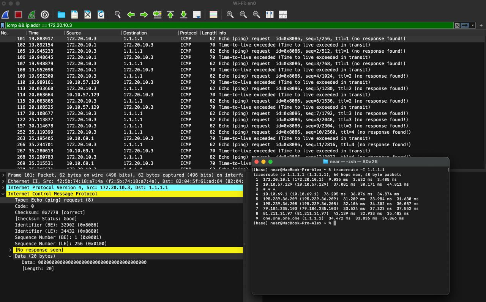
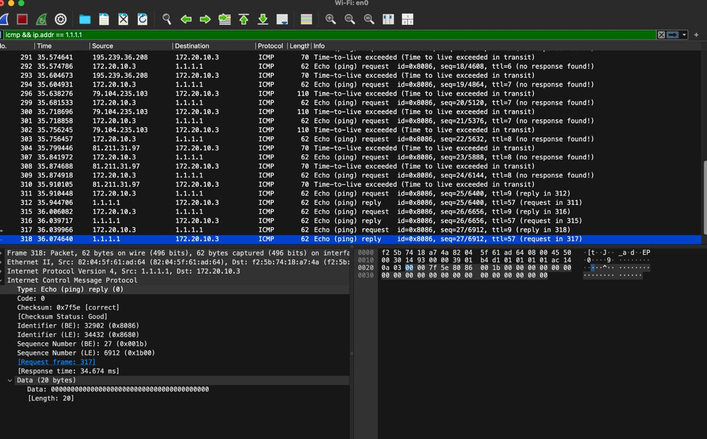

# Практика 9. Сетевой уровень

## Wireshark: ICMP
В лабораторной работе предлагается исследовать ряд аспектов протокола ICMP:
- ICMP-сообщения, генерируемые программой Ping
- ICMP-сообщения, генерируемые программой Traceroute
- Формат и содержимое ICMP-сообщения

### 1. Ping (4 балла)
Программа Ping на исходном хосте посылает пакет на целевой IP-адрес; если хост с этим адресом
активен, то программа Ping на нем откликается, отсылая ответный пакет хосту, инициировавшему
связь. Оба этих пакета Ping передаются по протоколу ICMP.

Выберите какой-либо хост, расположенный на другом континенте (например, в Америке или
Азии). Захватите с помощью Wireshark ICMP пакеты от утилиты ping.
Для этого из командной строки запустите команду (аргумент `-n 10` означает, что должно быть
отослано 10 ping-сообщений): `ping –n 10 host_name`

Для анализа пакетов в Wireshark введите строку icmp в области фильтрации вывода.

 
 

Cloudflare DNS:
```
ping -c 10 1.1.1.1
```

#### Вопросы
1. Каков IP-адрес вашего хоста? Каков IP-адрес хоста назначения?
   - 172.20.10.3
   - 1.1.1.1
2. Почему ICMP-пакет не обладает номерами исходного и конечного портов?
   - ICMP работает на сетевом уровне, а порты используются протоколами транспортного уровня, например TCP и UDP.
3. Рассмотрите один из ping-запросов, отправленных вашим хостом. Каковы ICMP-тип и кодовый
   номер этого пакета? Какие еще поля есть в этом ICMP-пакете? Сколько байт приходится на поля 
   контрольной суммы, порядкового номера и идентификатора?
   - `Type = 8` (`Echo request`), `Code = 0`.
   - Поля: `Checksum`, `Identifier`, `Sequence Number`, `ICMP Data`.
   - `Checksum` — 2 байта, `Identifier` — 2 байта, `Sequence Number` — 2 байта.
4. Рассмотрите соответствующий ping-пакет, полученный в ответ на предыдущий. 
   Каковы ICMP-тип и кодовый номер этого пакета? Какие еще поля есть в этом ICMP-пакете? 
   Сколько байт приходится на поля контрольной суммы, порядкового номера и идентификатора?
   - `Type = 0` (`Echo reply`), `Code = 0`.
   - Поля: `Checksum`, `Identifier`, `Sequence Number`, `ICMP Data`.
   - `Checksum` — 2 байта, `Identifier` — 2 байта, `Sequence Number` — 2 байта.

### 2. Traceroute (4 балла)
Программа Traceroute может применяться для определения пути, по которому пакет попал с
исходного на конечный хост.

Traceroute отсылает первый пакет со значением TTL = 1, второй – с TTL = 2 и т.д. Каждый
маршрутизатор понижает TTL-значение пакета, когда пакет проходит через этот маршрутизатор.
Когда на маршрутизатор приходит пакет со значением TTL = 1, этот маршрутизатор отправляет
обратно к источнику ICMP-пакет, свидетельствующий об ошибке.

Задача – захватить ICMP пакеты, инициированные программой traceroute, в сниффере Wireshark.
В ОС Windows вы можете запустить: `tracert host_name`

Выберите хост, который **расположен на другом континенте**.

 
 

#### Вопросы
1. Рассмотрите ICMP-пакет с эхо-запросом на вашем скриншоте. Отличается ли он от ICMP-пакетов
   с ping-запросами из Задания 1 (Ping)? Если да – то как?
   - Почти не отличается: это тоже `Echo request`. Отличие в том, что traceroute отправляет такие пакеты с постепенно увеличивающимся TTL: `1`, `2`, ..., `9`.
2. Рассмотрите на вашем скриншоте ICMP-пакет с сообщением об ошибке. В нем больше полей,
   чем в ICMP-пакете с эхо-запросом. Какая информация содержится в этих дополнительных полях?
   - В сообщении `Time-to-live exceeded` еще содержится часть изначального пакета: IP-заголовок и первые байты ICMP-запроса, который вызвал ошибку.
3. Рассмотрите три последних ICMP-пакета, полученных исходным хостом. Чем эти пакеты
   отличаются от ICMP-пакетов, сообщающих об ошибках? Чем объясняются такие отличия?
   - Последние пакеты — это `Echo reply` от конечного хоста `1.1.1.1`, а не ошибки `Time-to-live exceeded`.
   - Потому что при `TTL = 9` пакеты уже дошли до адресата.
4. Есть ли такой канал, задержка в котором существенно превышает среднее значение? Можете
   ли вы, опираясь на имена маршрутизаторов, определить местоположение двух маршрутизаторов,
   расположенных на обоих концах этого канала?
   - Большинство задержек после второго узла находятся примерно в диапазоне `30-40 ms`, в целом равномерненько.
   - Разовый скачок до `76.205 ms` на узле `10.10.69.1`, но по именам маршрутизаторов местоположение определить сложно(наверное можно через whois попытать удачу, но понятное дело там тоже без гарантий физического места), так как в выводе в основном IP-адреса.

## Программирование.

### 1. IP-адрес и маска сети (1 балл)
Напишите консольное приложение, которое выведет IP-адрес вашего компьютера и маску сети на консоль.

#### Демонстрация работы
```
(base) near@MacBook-Pro-Alex lab09 % python3 ip_mask.py 
IP address = 172.20.10.3
Netmask = 255.255.255.240
```

### 2. Доступные порты (2 балла)
Выведите все доступные (свободные) порты в указанном диапазоне для заданного IP-адреса. 
IP-адрес и диапазон портов должны передаваться в виде входных параметров.

Просто проходим по диапозону и пытаемся подключиться.

#### Демонстрация работы

Порт 8080 я специально занял (например ``` python3 -m http.server 8080 ```)
```
(base) near@MacBook-Pro-Alex lab09 % python3 free_ports.py 127.0.0.1 8075 8085
8075
8076
8077
8078
8079
8081
8082
8083
8084
8085
```

Видим что его нет в списке.

### 3. Широковещательная рассылка для подсчета копий приложения (6 баллов)
Разработать приложение, подсчитывающее количество копий себя, запущенных в локальной сети.
Приложение должно использовать набор сообщений, чтобы информировать другие приложения
о своем состоянии. После запуска приложение должно рассылать широковещательное сообщение
о том, что оно было запущено. Получив сообщение о запуске другого приложения, оно должно
сообщать этому приложению о том, что оно работает. Перед завершением работы приложение
должно информировать все известные приложения о том, что оно завершает работу. На экран
должен выводиться список IP адресов компьютеров (с указанием портов), на которых приложение
запущено.

Приложение считает другое приложение запущенным, если в течение промежутка времени,
равного нескольким интервалам между рассылками широковещательных сообщений, от него
пришло сообщение.

**Такое приложение может быть использовано, например, при наличии ограничения на
количество лицензионных копий программ.*

Пример GUI:


#### Демонстрация работы
todo

## Задачи. Работа протокола TCP

### Задача 1. Докажите формулы (3 балла)
Пусть за период времени, в который изменяется скорость соединения с $\frac{W}{2 \cdot RTT}$
до $\frac{W}{RTT}$, только один пакет был потерян (очень близко к концу периода).
1. Докажите, что частота потери $L$ (доля потерянных пакетов) равна
   $$L = \dfrac{1}{\frac{3}{8} W^2 + \frac{3}{4} W}$$
2. Используйте выше полученный результат, чтобы доказать, что, если частота потерь равна
   $L$, то средняя скорость приблизительно равна
   $$\approx \dfrac{1.22 \cdot MSS}{RTT \cdot \sqrt{L}}$$

#### Решение
todo

### Задача 2. Найдите функциональную зависимость (3 балла)
Рассмотрим модификацию алгоритма управления перегрузкой протокола TCP. Вместо
аддитивного увеличения, мы можем использовать мультипликативное увеличение. 
TCP-отправитель увеличивает размер своего окна в небольшую положительную 
константу $a$ ($a > 1$), как только получает верный ACK-пакет.
1. Найдите функциональную зависимость между частотой потерь $L$ и максимальным
размером окна перегрузки $W$.
2. Докажите, что для этого измененного протокола TCP, независимо от средней пропускной
способности, TCP-соединение всегда требуется одинаковое количество времени для
увеличения размера окна перегрузки с $\frac{W}{2}$ до $W$.

#### Решение
Почти похожая задача(кроме ограничения на $a$ была в прошлой лабе). 

Разумно рассматривать $a < 2$ (иначе ровно одно увеличение и в целом очевидно).
Тогда $a = 1 + a'$, $a' < 1$. Но мы уже для $a'$ доказали в прошлой лабе. Доказано(просто зачем писать одно и тоже дважды)

Зависимость тоже можно переписать по аналогии($L = 2(a - 1) / (W(2a - 1))$ или что то такое)